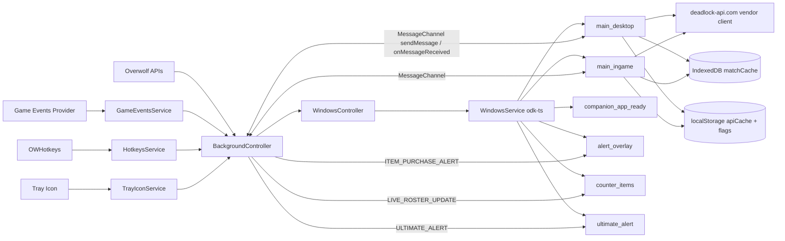

# 01 — Architecture

This doc explains the high-level runtime model: what process owns what, how the windows talk to each other, and how a game event becomes a UI update.

Read [`AGENTS.md`](../AGENTS.md) first.

---

## 1. Two sides of the app

Deadlock Companion has **two runtime sides** that share the same `src/shared/` code but never share React state:

1. **Background side** — a single hidden window (`background.html`) running TypeScript only. It owns Overwolf APIs, hotkeys, GEP subscriptions, the tray icon, the message channel, and decides which renderer windows are visible. There is exactly one instance, persisted for the app's lifetime.
2. **Renderer side** — one or more visible windows running React 18: `main_desktop`, `main_ingame`, `companion_app_ready`, `alert_overlay`, plus the static `uninstall` page. Each window is a separate webpack entry; each one boots its own React tree. They cannot directly call into each other — they communicate via `MessageChannel`.

The background process is the **single source of truth for game state and inter-window coordination**. Renderers display state and request changes via messages.

---

## 2. End-to-end flow diagram



---

## 3. Background bootstrap

[`src/main/background.ts`](../src/main/background.ts) is intentionally tiny:

```ts
BackgroundController.instance().run().catch((err) => console.error(err));
```

The work happens in [`BackgroundController`](../src/main/controllers/background.controller.ts) — a **lazy singleton** (`BackgroundController.instance()`) that wires every service together in its constructor and exposes a single `run()` method. Pattern to follow when adding services:

1. Construct the service in the singleton's constructor (no work in the ctor — just bind callbacks).
2. Subscribe to its events via the controller (`gepService.onNewEvents((e) => this.handleGameEvent(e))`).
3. Inside `run()`, decide initial window visibility based on whether Deadlock is already running (`overwolf.games.getRunningGameInfo`).

Services owned by the controller:

| Service | File | Role |
|---|---|---|
| `MessageChannel` | [`src/main/services/MessageChannel.ts`](../src/main/services/MessageChannel.ts) | Pub/sub on `overwolf.windows.sendMessage`. Singleton inside the controller. |
| `HotkeysService` | [`src/main/services/hotkeys.service.ts`](../src/main/services/hotkeys.service.ts) | `OWHotkeys.onHotkeyDown` for every id in `kHotkeys`. |
| `AppLaunchService` | [`src/main/services/app-launch.service.ts`](../src/main/services/app-launch.service.ts) | Dock / launcher click. Ignores game-launch origins to avoid double-show. |
| `TrayIconService` | [`src/main/services/tray-icon.service.ts`](../src/main/services/tray-icon.service.ts) | Click, double-click, and menu items (`show-window`, `close-window`, `close-app`). |
| `GameStateService` | [`src/main/services/game-state.service.ts`](../src/main/services/game-state.service.ts) | `overwolf.games.onGameInfoUpdated` filtered to Deadlock. |
| `GameEventsService` | [`src/main/services/game-events.service.ts`](../src/main/services/game-events.service.ts) | GEP: `setRequiredFeatures`, `onNewEvents`, `onInfoUpdates2`, error retries. |
| `ItemPurchaseTracker` | [`src/main/services/item-purchase-tracker.service.ts`](../src/main/services/item-purchase-tracker.service.ts) | Diffs `items_N` and roster, emits `ITEM_PURCHASE_ALERT`. |
| `UltimateTracker` | [`src/main/services/ultimate-tracker.service.ts`](../src/main/services/ultimate-tracker.service.ts) | Diffs `ultimate_trained`/`ultimate_ready` per roster entry, emits `ULTIMATE_ALERT`. |
| `WindowsController` | [`src/main/controllers/windows.controller.ts`](../src/main/controllers/windows.controller.ts) | Thin facade over `WindowsService` for show/hide/close per window. |

### Why a singleton?

The background window is created exactly once by Overwolf and never re-mounted. There is no benefit to multiple controller instances, and several services (notably `MessageChannel`) attach global listeners that must not be re-registered. **Do not** re-instantiate any of these services inside other modules.

---

## 4. Window lifecycle

Window operations are routed through [`WindowsController`](../src/main/controllers/windows.controller.ts), which delegates to the odk-ts wrappers in [`src/main/services/windows-odk/`](../src/main/services/windows-odk/):

- `WindowsService` — `DesktopWindow` for `main_desktop`, `OSRWindow` for in-game overlays. Holds a `windowsConfigs` map keyed by manifest window name.
- `MonitorsService` — `overwolf.utils.getMonitorsList` cached as `Map<id, MonitorInfo>`. Use `ensureMonitorsMapReady()` before referencing monitors.

Lifecycle handlers:

| Trigger | Handler | Does what |
|---|---|---|
| App launches & game is **not** running | `BackgroundController.run()` | `showMainDesktopWindow('primary')` |
| Deadlock launches | `WindowsController.onGameLaunch()` | Ensures monitors map, shows desktop on secondary monitor (if any), shows `companion_app_ready`, creates `main_ingame` |
| Deadlock exits | `WindowsController.onGameExit()` | Closes in-game, companion-ready, alert overlay; shows desktop primary |
| Match starts (GEP) | `BackgroundController.onMatchStart` | Shows `alert_overlay`, `counter_items`, and `ultimate_alert` (if enabled in `overlayLayoutStore`), broadcasts `LIVE_MATCH_START` |
| Match ends (GEP) | `BackgroundController.onMatchEnd` | Closes `alert_overlay`, `counter_items`, and `ultimate_alert`, broadcasts `LIVE_MATCH_END`, persists roster snapshot |
| Hotkey | `HotkeysService` callback → `WindowsController.toggle*` | Toggles desktop, in-game main, or counter items window |

**Manifest contract:** every window name string used in `WindowsService.windowsConfigs` must also exist in [`public/manifest.json`](../public/manifest.json) `data.windows` (or be created dynamically via odk-ts) and in [`kWindowNames`](../src/shared/consts.ts).

---

## 5. Renderer bootstrap

Each renderer entry is a single `Main`-style component mounted via `createRoot`:

- [`src/renderer/main-window/Main.tsx`](../src/renderer/main-window/Main.tsx) — main_desktop **and** main_ingame share this exact bundle (two webpack entries pointing at the same source).
- [`src/renderer/companion-ready-window/CompanionAppReady.tsx`](../src/renderer/companion-ready-window/CompanionAppReady.tsx)
- [`src/renderer/alert-overlay-window/AlertOverlay.tsx`](../src/renderer/alert-overlay-window/AlertOverlay.tsx)

Renderer-side responsibilities:

1. Render UI based on local hooks + messages from background.
2. Persist user-facing state (filters, view selection) in `localStorage`.
3. Persist heavy data (match metadata) in IndexedDB via `matchCache`.
4. Hit `deadlock-api.com` directly through the vendor client wrapped in `apiCache`.

Renderers do **not**:

- Subscribe to GEP directly (that's the background's job).
- Hold authoritative game state — they request snapshots via `MessageType.REQUEST_LIVE_MATCH_STATE`.
- Manage other windows' lifecycle.

---

## 6. The "router" is config + a CustomEvent

`Main.tsx` does not use React Router. It keeps an `activeView: string` in `useState`, persists it under `deadlock_companion_active_view`, and looks up the active component from [`viewsConfig`](../src/renderer/main-window/config/views.config.ts):

```ts
const ActiveViewComponent =
  viewsConfig.find((v) => v.name === activeView)?.component ?? null;
```

To navigate from anywhere in the tree:

```ts
window.dispatchEvent(new CustomEvent('navigate-view', { detail: 'Match History' }));
```

`MainInner` listens for this event, validates the name against `viewsConfig`, closes Settings, and updates state. This is the **only** correct way to switch tabs from a child component. Full details: [`docs/03-views-and-navigation.md`](03-views-and-navigation.md).

---

## 7. Cross-window messaging in detail

The pattern is uniform — once you've learned it, every new message looks the same.

### Sending (background → renderer)

```ts
import { MessageChannel, MessageType } from '../services/MessageChannel';
import { kWindowNames } from '../../shared/consts';

await messageChannel.sendMessage(
  kWindowNames.mainDesktop,
  MessageType.LIVE_MATCH_START,
  payload,
);
```

`MessageChannel.sendMessage` builds `{ type, data, timestamp }` and calls `overwolf.windows.sendMessage(targetWindow, type, payload, callback)`. Use `broadcastMessage([...windows], type, data)` to fan out.

### Receiving (renderer)

Renderers use `overwolf.windows.onMessageReceived` directly (the renderer side does not instantiate `MessageChannel`):

```ts
useEffect(() => {
  const handler = (message: overwolf.windows.MessageReceivedEvent) => {
    const payload = typeof message.content === 'string'
      ? JSON.parse(message.content)
      : message.content;
    if (payload?.type === MessageType.LIVE_MATCH_START) { /* ... */ }
  };
  overwolf.windows.onMessageReceived.addListener(handler);
  return () => overwolf.windows.onMessageReceived.removeListener(handler);
}, []);
```

### Receiving (background)

The background uses the `MessageChannel` registry:

```ts
this._unsubLiveState = this._messageChannel.onMessage(
  MessageType.REQUEST_LIVE_MATCH_STATE,
  () => this.broadcastRosterUpdate(),
);
```

### Renderer → background

Renderer sends to the well-known window name `'background'`:

```ts
overwolf.windows.sendMessage('background', MessageType.REQUEST_LIVE_MATCH_STATE, payload, () => {});
```

Add new `MessageType` enum values in alphabetical groups inside [`MessageChannel.ts`](../src/main/services/MessageChannel.ts) and document the contract (sender, receiver(s), payload shape) in a code comment next to the enum entry.

---

## 8. Webpack multi-entry mapping

[`webpack.config.js`](../webpack.config.js) declares one entry per window and one `HtmlWebpackPlugin` per HTML output. The mapping is intentionally explicit — adding a window requires editing this file. Note that `main_desktop` and `main_ingame` are two entries pointing at the **same** source file; they produce two separate bundles so each window has its own React root.

```js
entry: {
  background: './src/main/background.ts',
  main_desktop: './src/renderer/main-window/Main.tsx',
  main_ingame: './src/renderer/main-window/Main.tsx',
  companion_app_ready: './src/renderer/companion-ready-window/CompanionAppReady.tsx',
  alert_overlay: './src/renderer/alert-overlay-window/AlertOverlay.tsx',
}
```

Output: `dist/js/[name].js`. The static `public/` tree (manifest, css, icons, img) is copied verbatim by `CopyPlugin`. CSS is bundled inline via `style-loader` — there is no CSS extraction.

A build-time `webpack.DefinePlugin` injects a base64-encoded Steam Web API key as `__STEAM_WEB_KEY__`, decoded with `atob()` at runtime in [`steamWebApi.ts`](../src/shared/services/steamWebApi.ts).

---

## 9. Where to look next

- Visual identity, tokens, component inventory → [`02-ui-and-design-system.md`](02-ui-and-design-system.md)
- Tab system + `navigate-view` mechanics → [`03-views-and-navigation.md`](03-views-and-navigation.md)
- Manifest / hotkeys / GEP / messaging deep dive → [`06-overwolf-integration.md`](06-overwolf-integration.md)
- Persistence layers → [`05-data-and-persistence.md`](05-data-and-persistence.md)
