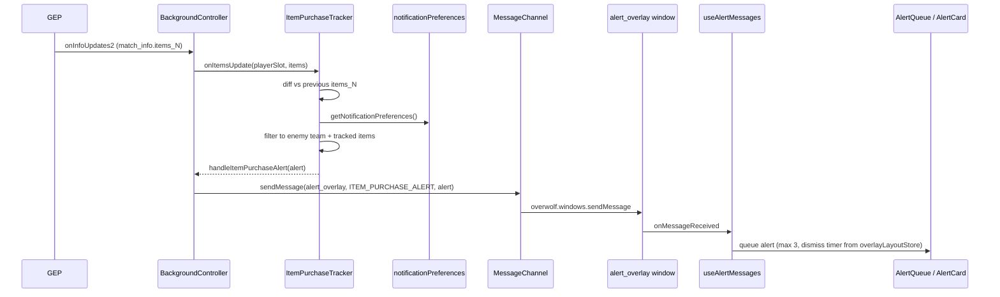

# 06 — Overwolf Integration

This doc covers everything that talks to Overwolf or the game: the manifest, hotkeys, the Game Events Provider (GEP), cross-window messaging, the deadlock-api client, and the item-purchase alert pipeline.

Read [`AGENTS.md`](../AGENTS.md) and [`docs/01-architecture.md`](01-architecture.md) first.

---

## 1. The manifest

[`public/manifest.json`](../public/manifest.json) is the contract with Overwolf. It declares windows, hotkeys, permissions, and game targeting. It is copied into `dist/` verbatim by `CopyPlugin`.

Key sections:

```json
"meta": {
  "name": "Deadlock Companion",
  "version": "1.1.0",
  "minimum-overwolf-version": "0.160.0",
  ...
},
"permissions": ["Extensions", "Hotkeys", "GameInfo", "DesktopStreaming", "Tray"],
"data": {
  "start_window": "background",
  "hotkeys": { "ToggleInGameMain": ..., "ToggleDesktopMain": ... },
  "windows": { "background": ..., "main_desktop": ..., "main_ingame": ..., "alert_overlay": ... },
  "game_targeting": { "type": "dedicated", "game_ids": [24482] },
  "game_events": [24482],
  "launch_events": [{ "event": "GameLaunch", "event_data": { "game_ids": [24482] }, "start_minimized": true }]
}
```

Game id `24482` is **Deadlock**. Constant: [`kDeadlockClassId`](../src/shared/consts.ts).

When you change the manifest, **bump `meta.version`** (also in `package.json`) so Overwolf treats it as a new build.

### The "new window" contract — four files always

Adding a window means editing four places in lockstep:

1. [`public/manifest.json`](../public/manifest.json) → `data.windows.<name>` (file, sizing, transparency, in-game vs desktop)
2. [`webpack.config.js`](../webpack.config.js) → add an `entry` and a `HtmlWebpackPlugin`
3. [`src/shared/consts.ts`](../src/shared/consts.ts) → add the name to `kWindowNames`
4. [`src/main/services/windows-odk/windows.service.ts`](../src/main/services/windows-odk/windows.service.ts) → add a config entry to `windowsConfigs`

Then update [`WindowsController`](../src/main/controllers/windows.controller.ts) with `show*` / `close*` methods, and (if needed) wire it into `BackgroundController` lifecycle handlers.

---

## 2. Hotkeys

The full chain (manifest → enum → service → controller → UI):

### Step 1: declare in manifest

```json
"hotkeys": {
  "ToggleInGameMain":  { "title": "Toggle In-Game Main",  "action-type": "custom", "default": "Ctrl+T" },
  "ToggleDesktopMain": { "title": "Toggle Desktop Main",  "action-type": "custom", "default": "Ctrl+Shift+T" }
}
```

The keys here (`ToggleInGameMain`, `ToggleDesktopMain`) are the canonical hotkey ids — they appear in every layer below.

### Step 2: mirror in `kHotkeys`

[`src/shared/consts.ts`](../src/shared/consts.ts):

```ts
export const kHotkeys = {
  toggleMainIngameWindow: 'ToggleInGameMain',
  toggleMainDesktopWindow: 'ToggleDesktopMain',
};
```

### Step 3: bind in `HotkeysService`

[`src/main/services/hotkeys.service.ts`](../src/main/services/hotkeys.service.ts) automatically registers an `OWHotkeys.onHotkeyDown` listener for every value in `kHotkeys`:

```ts
Object.values(kHotkeys).forEach((hotkeyName) => {
  OWHotkeys.onHotkeyDown(hotkeyName, (e) => this.handleHotkey(e));
});
```

You don't need to edit this file when adding a new hotkey — adding it to `kHotkeys` is enough.

### Step 4: wire the callback in `BackgroundController`

```ts
this._hotkeysService.on(kHotkeys.toggleMainDesktopWindow, () =>
  this._windowsController.toggleMainDesktopWindow(),
);
```

### Step 5: surface in the Settings UI

The Settings view reads bindings via [`HotkeysAPI`](../src/shared/services/hotkeys.ts) (`fetchAll()`, `update(name, binding)`). Display titles come from the manifest's `title` field. New hotkeys appear automatically once registered above.

---

## 3. Game Events Provider (GEP)

GEP is Overwolf's stream of in-game events and "info updates" (full state snapshots). Owned by [`GameEventsService`](../src/main/services/game-events.service.ts), routed by [`BackgroundController`](../src/main/controllers/background.controller.ts).

### Subscribed features

```ts
gepService.onGameLaunched(['game_info', 'match_info']);
```

Two top-level features for Deadlock:

| Feature | Notable info keys | Notable events |
|---|---|---|
| `game_info` | `match_history` (JSON array of recent matches), `game_mode`, `team_score` | — |
| `match_info` | `match_id`, `match_outcome`, roster fields, `items_0`–`items_11` | `match_start`, `match_end` |

`setRequiredFeatures` is retried internally — Overwolf occasionally returns a "not registered" error during the first few seconds of a match.

### Routing

`onNewEvents(events)` → `BackgroundController.handleGameEvent` switches on `events.events[*].name`:

- `match_start` → `onMatchStart()` — broadcasts `LIVE_MATCH_START`, shows `alert_overlay` (if enabled in `overlayLayoutStore`), resets `ItemPurchaseTracker`.
- `match_end` → `onMatchEnd()` — broadcasts `LIVE_MATCH_END`, persists final roster snapshot to `dl-roster-snapshots`, closes `alert_overlay`.
- Anything else is logged at warn level and ignored.

`onInfoUpdates2(update)` → `handleInfoUpdate` walks each feature key in `update.info`:

- `match_info.match_id` → store as current match id
- `match_info.match_outcome` → call `submitSaltsToApi(match_outcome)` if Patreon API key configured
- `match_info.items_N` → forward to `ItemPurchaseTracker.onItemsUpdate(playerSlot, items)`
- `match_info.<roster fields>` → forward to `ItemPurchaseTracker.onRosterUpdate` and broadcast `LIVE_ROSTER_UPDATE`
- `game_info.match_history` → JSON.parse, normalize, broadcast `MATCH_HISTORY_UPDATE` (consumed by `useGameEventMatches`, persisted to `dl-game-event-matches`)
- `game_info.game_mode` / `team_score` → update internal state, broadcast `LIVE_ROSTER_UPDATE`

### Adding a new GEP event

1. If it's a new top-level feature, add it to the `setRequiredFeatures` array in `GameEventsService`.
2. Handle it in `BackgroundController.handleGameEvent` (for `events`) or `handleInfoUpdate` (for `info`).
3. If the data should reach a renderer, define a new `MessageType` and broadcast it. **Don't** broadcast raw GEP — normalize it into a typed payload first (mirror `LiveRosterUpdatePayload`).

### Steam ID

The user's Steam ID is extracted by `getSteamIdFromGameInfo` in [`game-events.service.ts`](../src/main/services/game-events.service.ts) and persisted under `localStorage.deadlock_companion_steam_id`. Renderers read it via the [`useSteamId`](../src/renderer/hooks/useSteamId.ts) hook, which also listens for the `storage` event so cross-window updates propagate.

---

## 4. Cross-window messaging via `MessageChannel`

[`src/main/services/MessageChannel.ts`](../src/main/services/MessageChannel.ts) wraps `overwolf.windows.sendMessage` and `overwolf.windows.onMessageReceived` into a typed pub/sub. The instance lives on `BackgroundController` (`this._messageChannel`).

### The `MessageType` enum (current contract)

```ts
export enum MessageType {
  GAME_STATE_CHANGED        = 'game-state-changed',
  CHECK_FTUE_STATUS         = 'check-ftue-status',
  FTUE_STATUS_RESPONSE      = 'ftue-status-response',
  HOTKEY_UPDATED            = 'hotkey-updated',
  MATCH_HISTORY_UPDATE      = 'match-history-update',
  INGEST_PROMPT             = 'ingest-prompt',
  LIVE_MATCH_START          = 'live-match-start',
  LIVE_MATCH_END            = 'live-match-end',
  LIVE_ROSTER_UPDATE        = 'live-roster-update',
  REQUEST_LIVE_MATCH_STATE  = 'request-live-match-state',
  ROSTER_SNAPSHOT           = 'roster-snapshot',
  ITEM_PURCHASE_ALERT       = 'item-purchase-alert',
  CUSTOM                    = 'custom',
}
```

### Sending from the background

```ts
import { kWindowNames } from '../../shared/consts';
import { MessageType } from '../services/MessageChannel';

await this._messageChannel.sendMessage(
  kWindowNames.mainDesktop,
  MessageType.MATCH_HISTORY_UPDATE,
  matches,
);
```

The channel wraps your `data` in `{ type, data, timestamp }` and posts it via Overwolf's transport.

### Sending to multiple windows

```ts
await this._messageChannel.broadcastMessage(
  [kWindowNames.mainDesktop, kWindowNames.mainIngame],
  MessageType.LIVE_ROSTER_UPDATE,
  payload,
);
```

### Listening in the background

```ts
this._unsubLiveState = this._messageChannel.onMessage(
  MessageType.REQUEST_LIVE_MATCH_STATE,
  () => this.broadcastRosterUpdate(),
);
```

### Listening in a renderer

Renderers do **not** instantiate `MessageChannel` — they subscribe via `overwolf.windows.onMessageReceived` directly:

```ts
useEffect(() => {
  const handler = (msg: overwolf.windows.MessageReceivedEvent) => {
    const payload = typeof msg.content === 'string'
      ? JSON.parse(msg.content)
      : msg.content;
    if (payload?.type === MessageType.LIVE_MATCH_START) {
      // ...
    }
  };
  overwolf.windows.onMessageReceived.addListener(handler);
  return () => overwolf.windows.onMessageReceived.removeListener(handler);
}, []);
```

### Sending from a renderer to the background

Use the literal window name `'background'`:

```ts
overwolf.windows.sendMessage(
  'background',
  MessageType.REQUEST_LIVE_MATCH_STATE,
  { type: MessageType.REQUEST_LIVE_MATCH_STATE, timestamp: Date.now() },
  () => {},
);
```

(The verbose payload shape mirrors the channel's wrapping so background handlers see the same structure either way.)

### Adding a new message

1. Append a value to the `MessageType` enum. Add a one-line comment describing the sender, target, and payload type.
2. Create or extend a type in [`src/shared/types/`](../src/shared/types/) for the payload.
3. Send from the background (or renderer) using the rules above.
4. Listen in the target window. If it's a renderer, parse `message.content` and switch on `payload.type`.
5. Add a brief entry to the per-window section of [`docs/01-architecture.md`](01-architecture.md) if it's a major new flow.

---

## 5. The deadlock-api client

`https://api.deadlock-api.com` is reached **only** through the typed vendor client at [`src/shared/vendor/deadlock-api-client/`](../src/shared/vendor/deadlock-api-client/) (generated from the OpenAPI spec — do not hand-edit) plus the configured wrappers under [`src/shared/services/deadlock-api/`](../src/shared/services/deadlock-api/).

### Configuration

```ts
import { deadlockApiConfig } from '../../shared/services/deadlock-api/deadlockApiClient';
import { MatchesApi } from 'deadlock_api_client';

const api = new MatchesApi(deadlockApiConfig);
const { data } = await api.getMatchMetadata({ matchId });
```

`createDeadlockApiConfig()` builds a `Configuration` with `basePath: 'https://api.deadlock-api.com'` and an optional API key from `localStorage.deadlock_companion_api_key` (Patreon supporters).

### Wrappers and caching

| Wrapper | Endpoint family | Cache |
|---|---|---|
| [`assetsApiService.ts`](../src/shared/services/deadlock-api/assetsApiService.ts) | `https://assets.deadlock-api.com` items, heroes | `apiCache` `ITEM_METADATA` |
| [`itemsApiService.ts`](../src/shared/services/deadlock-api/itemsApiService.ts) | `AnalyticsApi`, `PatchesApi` | `apiCache` `ITEM_ANALYTICS` / `PATCHES` |
| [`matchMetadataFetcher.ts`](../src/shared/services/matchMetadataFetcher.ts) | `MatchesApi`, `InternalApi` | `matchCache` (IndexedDB) |
| [`steamWebApi.ts`](../src/shared/services/steamWebApi.ts) | Steam Web API fallback | `apiCache` `STEAM_PROFILE` |

Rules:

- **Never** call `fetch('https://api.deadlock-api.com/...')` directly. Use the typed client.
- For assets (icons, hero portraits), `assetsApiService` uses `axios` against the assets host — also cached.
- Always wrap fetchers in `try/catch` and degrade (return `null`/`[]`). Log via `createLogger`.
- Respect cache TTLs (see [`docs/05-data-and-persistence.md`](05-data-and-persistence.md)).

### Steam Web API key

The Steam Web API key is base64-encoded in [`webpack.config.js`](../webpack.config.js) and injected as `__STEAM_WEB_KEY__` via `webpack.DefinePlugin`. [`steamWebApi.ts`](../src/shared/services/steamWebApi.ts) decodes it with `atob()` at runtime. Do not commit a plaintext key, and do not introduce a second key.

---

## 6. Item-purchase alert pipeline

This is the most elaborate end-to-end flow in the app. Use it as a reference when wiring a new game-event-driven UI.



Key files:

- [`item-purchase-tracker.service.ts`](../src/main/services/item-purchase-tracker.service.ts) — diff logic + filter
- [`notificationPreferences.ts`](../src/shared/stores/notificationPreferences.ts) — `tracked_item_ids` + presets
- [`overlayLayoutStore.ts`](../src/shared/stores/overlayLayoutStore.ts) — `getWidgetConfig('item_purchase_alert')` for `enabled`, `dock_edge`, `layout_mode`, `dismiss_timeout_s`
- [`AlertOverlay.tsx`](../src/renderer/alert-overlay-window/AlertOverlay.tsx) — window root
- [`useAlertMessages.ts`](../src/renderer/alert-overlay-window/hooks/useAlertMessages.ts) — listens for `MessageType.ITEM_PURCHASE_ALERT`, queues, auto-dismisses
- [`AlertQueue.tsx`](../src/renderer/alert-overlay-window/components/AlertQueue.tsx) / `AlertCard.tsx` — presentation

When extending:

- New alert subtypes → add a discriminator field on `ItemPurchaseAlert` (or a new payload type) and a new `MessageType` if the consumer is different.
- New filter rules → keep them in `ItemPurchaseTracker`, not in the renderer. The renderer should only render what arrives.
- New visual layouts → respect `overlayLayoutStore.layout_mode` so the user can pick a position.

---

## 7. Tray icon

[`tray-icon.service.ts`](../src/main/services/tray-icon.service.ts) sets a context menu with `show-window`, `close-window`, `close-app` and forwards click / double-click. Wire callbacks in `BackgroundController` — this service is intentionally thin.

`closeApp` lives in [`WindowsService`](../src/main/services/windows-odk/windows.service.ts) and uses `overwolf.windows.getMainWindow()` to close the background window (the only legitimate use of `getMainWindow` in the codebase).

---

## 8. Companion-ready and uninstall windows

- **Companion-ready** ([`CompanionAppReady.tsx`](../src/renderer/companion-ready-window/CompanionAppReady.tsx)) is shown briefly when Deadlock launches to confirm the companion is running. It auto-closes on a 10 s timer; the background also has its own 10 s timer that calls `closeCompanionAppReadyWindow` — both paths exist for safety.
- **Uninstall** ([`uninstall.html`](../src/renderer/uninstall-window/uninstall.html)) is a static HTML page that opens a feedback Google Form via `overwolf.utils.openUrlInDefaultBrowser`. Triggered automatically by Overwolf on uninstall — referenced from `manifest.json` under `data.uninstall_window`.

---

## 9. Things to avoid

- Calling `overwolf.windows.*` directly outside `WindowsService`, `MessageChannel`, `AppHeader` (drag/min/max/close), or hotkey handlers. The wrappers exist so the rest of the app stays portable.
- Adding a window without updating all four contract files (manifest, webpack, `kWindowNames`, `windowsConfigs`).
- Sending raw GEP payloads over `MessageChannel`. Normalize into a typed shape first.
- Reading or writing the manifest from runtime code. Treat it as build-time only.
- Calling `fetch` against `api.deadlock-api.com`. Use the typed client.
- Subscribing to GEP from a renderer. Renderers receive normalized data via `MessageChannel`.

---

## 10. Where to look next

- Storage decisions for what GEP delivers → [`05-data-and-persistence.md`](05-data-and-persistence.md)
- Style and naming conventions → [`07-conventions.md`](07-conventions.md)
- End-to-end checklists for new windows / messages / hotkeys → [`08-adding-a-feature.md`](08-adding-a-feature.md)
